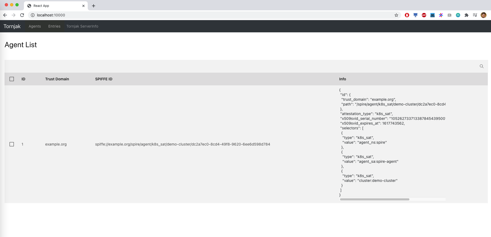

# Tornjak simple deployment with SPIRE k8s quickstart

In this tutorial, we will show how one can try out tornjak with a SPIRE deployment using the SPIRE k8s quickstart tutorial. As we will see, this is as simple as setting up SPIRE, and replacing the image with the Tornjak compatible image for the SPIRE server. A walkthrough of this guide is also available through [video](https://www.youtube.com/watch?v=QBNqImUeKcE).

## Step 1: Setup SPIRE k8s quickstart tutorial (optional)

For this tutorial we will utilize the SPIRE k8s quickstart deployment for a SPIRE deployment. If you have a SPIRE deployment set up already, you may skip this step and go ahead to the [section: configuring Tornjak](#step-2-configuring-tornjak). If not we will use the [SPIRE quickstart for Kubernetes](https://spiffe.io/docs/latest/try/getting-started-k8s/).

### Setting up k8s

For this tutorial, we will use minikube, if you have an existing kubernetes cluster, feel free to use that.

```
➜  ~ minikube start
😄  minikube v1.12.0 on Darwin 11.2
🎉  minikube 1.18.1 is available! Download it: https://github.com/kubernetes/minikube/releases/tag/v1.18.1
💡  To disable this notice, run: 'minikube config set WantUpdateNotification false'
✨  Automatically selected the docker driver. Other choices: hyperkit, virtualbox
👍  Starting control plane node minikube in cluster minikube
🔥  Creating docker container (CPUs=2, Memory=1989MB) ...
🐳  Preparing Kubernetes v1.18.3 on Docker 19.03.2 ...
🔎  Verifying Kubernetes components...
🌟  Enabled addons: default-storageclass, storage-provisioner
🏄  Done! kubectl is now configured to use "minikube"

➜  ~ kubectl get nodes
NAME       STATUS   ROLES    AGE   VERSION
minikube   Ready    master   79s   v1.18.3
```


### Setting up the SPIRE deployment

Next, we will follow the steps from the [SPIRE quickstart for Kubernetes](https://spiffe.io/docs/latest/try/getting-started-k8s/), for the most accurate information, follow the instructions from the page to get your SPIRE deployment set up. Follow through with the tutorial till you get to the end, but do not tear down the components! The output would look like the following:

```
➜  ~ git clone git@github.com:spiffe/spire-tutorials.git
Cloning into 'spire-tutorials'...
remote: Enumerating objects: 65, done.
remote: Counting objects: 100% (65/65), done.
remote: Compressing objects: 100% (49/49), done.
remote: Total 725 (delta 20), reused 52 (delta 16), pack-reused 660
Receiving objects: 100% (725/725), 1008.46 KiB | 9.08 MiB/s, done.
Resolving deltas: 100% (327/327), done.

➜  ~ cd spire-tutorials/k8s/quickstart

➜  quickstart git:(master) kubectl apply -f spire-namespace.yaml
namespace/spire created

➜  quickstart git:(master)  kubectl apply \
    -f server-account.yaml \
    -f spire-bundle-configmap.yaml \
    -f server-cluster-role.yaml
serviceaccount/spire-server created
configmap/spire-bundle created
clusterrole.rbac.authorization.k8s.io/spire-server-trust-role created
clusterrolebinding.rbac.authorization.k8s.io/spire-server-trust-role-binding created

➜  quickstart git:(master) kubectl apply \
    -f server-configmap.yaml \
    -f server-statefulset.yaml \
    -f server-service.yaml
configmap/spire-server created
statefulset.apps/spire-server created
service/spire-server created

➜  quickstart git:(master) kubectl get statefulset --namespace spire
NAME           READY   AGE
spire-server   1/1     26s

➜  quickstart git:(master) kubectl apply \
    -f agent-account.yaml \
    -f agent-cluster-role.yaml
serviceaccount/spire-agent created
clusterrole.rbac.authorization.k8s.io/spire-agent-cluster-role created
clusterrolebinding.rbac.authorization.k8s.io/spire-agent-cluster-role-binding created

➜  quickstart git:(master) kubectl apply \
    -f agent-configmap.yaml \
    -f agent-daemonset.yaml
configmap/spire-agent created
daemonset.apps/spire-agent created

➜  quickstart git:(master) kubectl get daemonset --namespace spire
NAME          DESIRED   CURRENT   READY   UP-TO-DATE   AVAILABLE   NODE SELECTOR   AGE
spire-agent   1         1         1       1            1           <none>          19s

➜  quickstart git:(master) kubectl exec -n spire spire-server-0 -- \
    /opt/spire/bin/spire-server entry create \
    -spiffeID spiffe://example.org/ns/spire/sa/spire-agent \
    -selector k8s_sat:cluster:demo-cluster \
    -selector k8s_sat:agent_ns:spire \
    -selector k8s_sat:agent_sa:spire-agent \
    -node
Entry ID         : 03d0ec2b-54b7-4340-a0b9-d3b2cf1b041a
SPIFFE ID        : spiffe://example.org/ns/spire/sa/spire-agent
Parent ID        : spiffe://example.org/spire/server
Revision         : 0
TTL              : default
Selector         : k8s_sat:agent_ns:spire
Selector         : k8s_sat:agent_sa:spire-agent
Selector         : k8s_sat:cluster:demo-cluster

➜  quickstart git:(master) kubectl exec -n spire spire-server-0 -- \
    /opt/spire/bin/spire-server entry create \
    -spiffeID spiffe://example.org/ns/default/sa/default \
    -parentID spiffe://example.org/ns/spire/sa/spire-agent \
    -selector k8s:ns:default \
    -selector k8s:sa:default
Entry ID         : 11a367ab-7095-4390-ab89-34dea5fddd61
SPIFFE ID        : spiffe://example.org/ns/default/sa/default
Parent ID        : spiffe://example.org/ns/spire/sa/spire-agent
Revision         : 0
TTL              : default
Selector         : k8s:ns:default
Selector         : k8s:sa:default

➜  quickstart git:(master) kubectl apply -f client-deployment.yaml
deployment.apps/client created

➜  quickstart git:(master) kubectl exec -it $(kubectl get pods -o=jsonpath='{.items[0].metadata.name}' \
   -l app=client)  -- /bin/sh
/opt/spire # /opt/spire/bin/spire-agent api fetch -socketPath /run/spire/sockets/agent.sock
Received 1 svid after 8.8537ms

SPIFFE ID:		spiffe://example.org/ns/default/sa/default
SVID Valid After:	2021-04-06 20:13:02 +0000 UTC
SVID Valid Until:	2021-04-06 21:13:12 +0000 UTC
CA #1 Valid After:	2021-04-06 20:12:20 +0000 UTC
CA #1 Valid Until:	2021-04-07 20:12:30 +0000 UTC

/opt/spire #
```


## Step 2: Configuring Tornjak

Now that we have the SPIRE deployment set up, it should be fairly simple to use Tornjak. 

### Replacing the SPIRE server image

We first need to use the Tornjak image. This can be done by modifying the image in the SPIRE server deployment:


```
➜  quickstart git:(master) cat server-statefulset.yaml
...
    spec:
      serviceAccountName: spire-server
      containers:
        - name: spire-server
          image: gcr.io/spiffe-io/spire-server:0.12.0
          args:
            - -config
            - /run/spire/config/server.conf
          ports:
            - containerPort: 8081
...
```

We want to replace the image with the Tornjak image: `tsidentity/tornjak-spire-server:0.12.0`

```
➜  quickstart git:(master) cat server-statefulset.yaml
...
    spec:
      serviceAccountName: spire-server
      containers:
        - name: spire-server
          image: tsidentity/tornjak-spire-server:0.12.0
          args:
            - -config
            - /run/spire/config/server.conf
          ports:
            - containerPort: 8081
...
```

We can then apply the changes of the statefulset deployment:

```
➜  quickstart git:(master) ✗ kubectl apply -f server-statefulset.yaml
statefulset.apps/spire-server configured
```

We will then wait and verify that the `spire-server-0` pod is now started with the new image:

```
➜  quickstart git:(master) ✗ kubectl -n spire describe pod spire-server-0 | grep "Image:"
    Image:         tsidentity/tornjak-spire-server:0.12.0
```

### Connecting to the Tornjak UI

The Tornjak HTTP server is running on port 10000 on the port. This can easily be accessed by performing a local port forward using `kubectl`. This will cause the local port 10000 to proxy to the Tornjak HTTP server.

```
➜  quickstart git:(master) ✗ kubectl -n spire port-forward spire-server-0 10000:10000
Forwarding from 127.0.0.1:10000 -> 10000
Forwarding from [::1]:10000 -> 10000
```

Open a browser to `http://localhost:10000` and you should now be able to start using the Tornjak UI!


